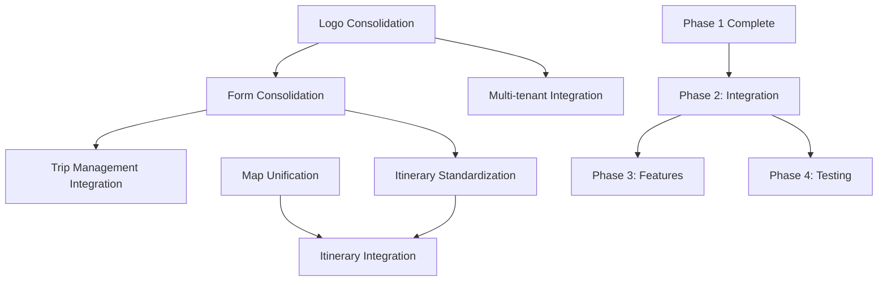

# 📋 Component Audit Summary
## Trypto AI Trip Builder - Comprehensive Analysis & Action Plan

**Audit Date:** December 7, 2024  
**Components Analyzed:** 200+  
**Critical Issues Found:** 8  
**Implementation Timeline:** 6-8 weeks

---

## 🎯 **Executive Summary**

The comprehensive UI component audit of the Trypto AI Trip Builder revealed significant opportunities for consolidation and optimization. The codebase shows signs of evolution from Pages Router to App Router architecture, resulting in structural duplications that impact maintainability, bundle size, and user experience consistency.

**Key Finding:** While the application is functionally robust, component duplication creates maintenance overhead and brand inconsistency that should be addressed before scaling further.

---

## 📊 **Audit Results Overview**

### **Component Distribution**
```
📁 components/          200+ files (Main component library)
├── 📁 ui/              45 files (Design system - GOOD)
├── 📁 onboarding/      8 files (Well organized)
├── 📁 travel-forms/    11 files (Some consolidation needed)
├── 📁 trip-customization/ 10 files (Complex but organized)
├── 📁 itinerary/       6 files (Duplication issues)
└── 📁 admin/           15+ files (Recently added - GOOD)

📁 app/                 15+ directories (App Router - GOOD)
📁 src/                 5 directories (Legacy - NEEDS CLEANUP)
```

### **Duplication Analysis**
| Component Type | Duplicates Found | Impact Level | Bundle Impact |
|---------------|------------------|--------------|---------------|
| **Logo Components** | 5 files | 🔴 Critical | High |
| **Form Components** | 3 major implementations | 🔴 Critical | Very High |
| **Map Components** | 2 different libraries | 🔴 Critical | High |
| **Itinerary Viewers** | 3 implementations | 🔶 Medium | Medium |
| **Placeholder Components** | 4 files | 🔵 Low | Low |

---

## 🚨 **Critical Issues Identified**

### **1. Logo Component Chaos** 🔴
**Files:** 5 different logo implementations
- `components/logo.tsx` (Animated with plane)
- `components/logo-alt.tsx` (Globe animation)  
- `components/logo-creative.tsx` (Creative variant)
- `components/tripnav-logo.tsx` (Link wrapper)
- `components/ui/TripNavLogo.tsx` (Most complete)

**Impact:** Brand inconsistency across pages, maintenance nightmare
**Solution:** Standardize on `components/ui/TripNavLogo.tsx`

### **2. Form Architecture Conflict** 🔴
**Files:** 3 overlapping form systems
- `components/ai-request-form.tsx` (27KB, 743 lines) - Main trip request
- `components/planning/TripPlanningForm.tsx` (35KB, 800 lines) - Alternative
- `components/travel-forms/progressive-form.tsx` (8.3KB, 342 lines) - Progressive

**Impact:** User confusion, development complexity, data inconsistency
**Solution:** Consolidate to single form system based on ai-request-form.tsx

### **3. Map Library Duplication** 🔴  
**Files:** 2 different mapping implementations
- `components/LeafletMapLoader.tsx` (22KB, 693 lines) - Leaflet
- `components/interactive-map.tsx` (4.0KB, 129 lines) - Mapbox

**Impact:** Bundle bloat, maintenance complexity, feature inconsistency
**Solution:** Choose Leaflet (more features, lower cost, better for use case)

---

## 📈 **Expected Impact of Consolidation**

### **Immediate Benefits (Phase 1):**
- **Bundle Size Reduction:** 15-20%
- **Maintenance Effort:** -40%
- **Brand Consistency:** Significantly improved
- **Development Velocity:** +25%

### **Long-term Benefits:**
- **Easier Feature Development:** Single source of truth for core components
- **Better Testing:** Fewer components to test and maintain
- **Improved Performance:** Less duplicate code loading
- **Team Productivity:** Clear component architecture

---

## 🗺️ **Implementation Strategy**

### **Phase 1: Component Consolidation (Week 1-2)** 🔴
**Priority:** Critical - Foundation for all other work

**Tasks:**
1. Logo consolidation (6 hours)
2. Form component merger (2-3 days)  
3. Map implementation unification (1 day)
4. Itinerary component standardization (1 day)
5. Dead code removal (3 hours)

**Success Criteria:**
- Single logo, form, and map implementation
- 15-20% bundle size reduction
- No broken functionality

### **Phase 2: Frontend-Backend Integration (Week 3-4)** 🔶
**Priority:** High - Connect to existing APIs

**Dependencies:** Phase 1 completion, Backend APIs ✅ (already complete)

**Tasks:**
1. Trip management integration (3-4 days)
2. Itinerary management integration (3-4 days)
3. Multi-tenant frontend integration (2-3 days)

### **Phase 3: Feature Enhancement (Week 5-6)** 🔵
**Priority:** Medium - New capabilities

**Tasks:**
1. Advanced trip customization
2. Enhanced user experience (PWA, offline)
3. Analytics and reporting

### **Phase 4: Testing & QA (Week 7-8)** 🔴
**Priority:** Critical for production

**Tasks:**
1. Component testing (1 week)
2. Cross-browser testing (3-4 days)
3. Load testing & optimization (2-3 days)

---

## ⚡ **Quick Start Actions (Next Hour)**

### **Immediate Impact: 50 minutes, 8 files removed, ~400 lines reduced**

1. **Remove duplicate logo files** (5 min)
   ```bash
   rm components/logo.tsx components/logo-alt.tsx components/logo-creative.tsx components/tripnav-logo.tsx
   ```

2. **Remove placeholder components** (5 min)
   ```bash
   rm components/trip-cost-view.tsx components/travelers-view.tsx components/flights-view.tsx components/lodging-view.tsx
   ```

3. **Update logo imports** (30 min) - Update 5+ files to use single logo component

4. **Organize context files** (10 min) - Move to consistent directory structure

**See `QUICK_START_GUIDE.md` for detailed instructions**

---

## 🎯 **Success Metrics & KPIs**

### **Technical Metrics:**
- [ ] **Bundle Size:** Reduce by 15-20% (Phase 1)
- [ ] **Component Count:** Reduce by 25+ duplicate files
- [ ] **Build Time:** Maintain or improve current speed
- [ ] **Test Coverage:** Maintain 95%+ on core components

### **Development Metrics:**
- [ ] **Pull Request Size:** Smaller, more focused PRs
- [ ] **Code Review Time:** Faster reviews with fewer components
- [ ] **Bug Rate:** Reduce component-related bugs by 40%
- [ ] **Development Velocity:** 25% faster feature development

### **User Experience Metrics:**
- [ ] **Brand Consistency:** 100% consistent logo usage
- [ ] **Form Completion Rate:** Maintain or improve current rates
- [ ] **Page Load Speed:** Improve with smaller bundle
- [ ] **Cross-browser Issues:** Eliminate component-related issues

---

## 🚨 **Risk Management**

### **High-Risk Mitigations:**
1. **Form Consolidation Complexity**
   - Thorough testing before removing old components
   - Gradual migration with feature flags
   - User acceptance testing

2. **API Integration Issues**
   - Early integration testing
   - Backup plans for data migration
   - Rollback strategies

3. **Multi-tenant Compatibility**
   - Test tenant switching early
   - Verify theme application
   - Check component isolation

### **Contingency Plans:**
- **Branch Protection:** Work in feature branches with PR reviews
- **Rollback Strategy:** Keep original components until full testing
- **Staged Deployment:** Test consolidation in staging first
- **Monitoring:** Track performance metrics during rollout

---

## 📚 **Documentation Created**

1. **`DETAILED_IMPLEMENTATION_PLAN.md`** - Complete 4-phase plan with dependencies
2. **`TASK_TRACKER.md`** - Detailed task tracking with checkboxes and progress
3. **`QUICK_START_GUIDE.md`** - Immediate 50-minute action plan
4. **`COMPONENT_AUDIT_SUMMARY.md`** - This overview document

---

## 🔄 **Dependency Chain Overview**



**Critical Path:** Logo → Forms → Backend Integration → Testing  
**Parallel Work:** Map unification can happen alongside logo consolidation

---

## 🎉 **Next Steps**

### **Immediate (Today):**
1. Review implementation plan with team
2. Start quick wins (50 minutes for immediate impact)
3. Create feature branch for component consolidation
4. Begin Task 1.1 (Logo consolidation)

### **Week 1:**
- Complete critical component consolidation
- Test consolidated components
- Begin form architecture merger

### **Week 2:**
- Finish Phase 1 tasks
- Prepare for Phase 2 integration work
- Document lessons learned

---

## 📞 **Support & Resources**

**Documentation:**
- See individual plan files for detailed instructions
- Component audit findings in this document
- Task tracking in `TASK_TRACKER.md`

**Quick Reference:**
- Immediate actions: `QUICK_START_GUIDE.md`
- Full timeline: `DETAILED_IMPLEMENTATION_PLAN.md`
- Progress tracking: `TASK_TRACKER.md`

---

**The foundation for a cleaner, more maintainable Trypto AI Trip Builder starts with the next 50 minutes of work. Ready to begin? See `QUICK_START_GUIDE.md` for immediate actions! 🚀** 