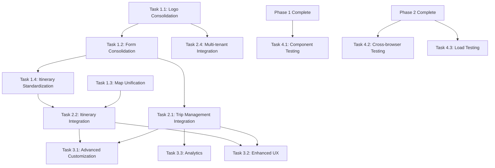

# 🚀 Detailed Implementation Plan
## Trypto AI Trip Builder - Component Consolidation & Feature Development

**Last Updated:** December 7, 2024  
**Status:** Phase 1 Planning Complete  
**Backend Status:** Tasks 1.3, 2.1, 2.2 ✅ COMPLETED

---

## 📋 **Executive Summary**

This plan addresses critical component duplications identified in the UI audit and outlines the remaining development tasks to complete the Trypto AI Trip Builder platform. The plan is organized into 4 phases with clear dependencies and estimated timelines.

**Total Estimated Timeline:** 6-8 weeks  
**Critical Path:** Component Consolidation → Frontend Integration → Feature Development → Testing

---

## 🎯 **Phase 1: Component Consolidation & Cleanup (Week 1-2)**
*Priority: CRITICAL - Addresses component audit findings*

### **Task 1.1: Logo Component Consolidation**
**Status:** 🔴 Critical  
**Dependencies:** None  
**Estimated Time:** 4-6 hours  

**Subtasks:**
- [ ] **1.1.1** Audit all logo usage across codebase
- [ ] **1.1.2** Standardize on `components/ui/TripNavLogo.tsx` (most feature-complete)
- [ ] **1.1.3** Remove duplicate logo files:
  - `components/logo.tsx`
  - `components/logo-alt.tsx` 
  - `components/logo-creative.tsx`
  - `components/tripnav-logo.tsx`
- [ ] **1.1.4** Update all imports to use single logo component
- [ ] **1.1.5** Test logo display across all pages

**Files Modified:**
- `components/ui/TripNavLogo.tsx` (enhance with all variants)
- `components/header.tsx` (update import)
- `components/landing-page.tsx` (update import)
- `components/ai-request-form.tsx` (update import)
- All other files using logo components

**Success Criteria:**
- Single logo component used throughout application
- Brand consistency maintained across all pages
- No broken logo displays

---

### **Task 1.2: Form Component Consolidation**
**Status:** 🔴 Critical  
**Dependencies:** Task 1.1 (for consistent branding)  
**Estimated Time:** 2-3 days  

**Subtasks:**
- [ ] **1.2.1** Analyze form component functionality overlap
- [ ] **1.2.2** Choose primary form implementation (`ai-request-form.tsx` - most feature-complete)
- [ ] **1.2.3** Extract reusable form components from chosen implementation
- [ ] **1.2.4** Create unified form data interface
- [ ] **1.2.5** Remove redundant form components:
  - `components/planning/TripPlanningForm.tsx`
  - `components/travel-forms/progressive-form.tsx`
- [ ] **1.2.6** Update pages using removed components
- [ ] **1.2.7** Create form component library documentation

**Files Modified:**
- `components/ai-request-form.tsx` (enhance as primary)
- `components/travel-forms/` (consolidate reusable parts)
- `app/demo/progressive-form/page.tsx` (update to use primary form)
- `src/pages.tsx` (ensure consistent form usage)

**New Files:**
- `components/forms/unified-trip-form.tsx`
- `types/form-interfaces.ts`
- `lib/form-validation.ts`

**Success Criteria:**
- Single trip planning form interface
- Consistent form data structure
- All form functionality preserved in consolidated component

---

### **Task 1.3: Map Implementation Unification**
**Status:** 🔴 Critical  
**Dependencies:** None  
**Estimated Time:** 1 day  

**Subtasks:**
- [ ] **1.3.1** Evaluate map implementations (Leaflet vs Mapbox)
- [ ] **1.3.2** Choose primary map library (recommend Leaflet for features)
- [ ] **1.3.3** Remove alternative map implementation
- [ ] **1.3.4** Create unified map component interface
- [ ] **1.3.5** Update all map usage to single implementation
- [ ] **1.3.6** Test map functionality across all features

**Decision Matrix:**
| Feature | Leaflet | Mapbox | Winner |
|---------|---------|---------|---------|
| Bundle Size | Smaller | Larger | Leaflet |
| Feature Set | Complete | Advanced | Leaflet |
| Maintenance | Active | Active | Tie |
| Cost | Free | Has limits | Leaflet |

**Files Modified:**
- Keep: `components/LeafletMapLoader.tsx`
- Remove: `components/interactive-map.tsx`
- Update all map imports

**Success Criteria:**
- Single map implementation used throughout
- All map features preserved
- Reduced bundle size

---

### **Task 1.4: Itinerary Component Standardization**
**Status:** 🔶 Medium  
**Dependencies:** Task 1.2 (form consolidation)  
**Estimated Time:** 1 day  

**Subtasks:**
- [ ] **1.4.1** Standardize on `ModernItineraryViewer.tsx` as primary
- [ ] **1.4.2** Remove legacy itinerary components:
  - `components/itinerary-view.tsx`
  - `components/itinerary-builder.tsx` (if redundant)
- [ ] **1.4.3** Update itinerary data interfaces
- [ ] **1.4.4** Test itinerary display functionality

**Files Modified:**
- `components/itinerary/ModernItineraryViewer.tsx` (enhance as primary)
- Remove legacy components
- Update imports across application

---

### **Task 1.5: Dead Code Removal**
**Status:** 🔵 Low  
**Dependencies:** Tasks 1.1-1.4 (ensure components not needed)  
**Estimated Time:** 2-3 hours  

**Subtasks:**
- [ ] **1.5.1** Remove placeholder components:
  - `components/trip-cost-view.tsx`
  - `components/travelers-view.tsx`
  - `components/flights-view.tsx`
  - `components/lodging-view.tsx`
- [ ] **1.5.2** Remove unused expandable component variants
- [ ] **1.5.3** Clean up unused imports
- [ ] **1.5.4** Run linting and fix warnings

---

## 🔗 **Phase 2: Frontend-Backend Integration (Week 3-4)**
*Priority: HIGH - Connect consolidated frontend to backend APIs*

### **Task 2.1: Trip Management Integration**
**Status:** 🔶 Medium  
**Dependencies:** Task 1.2 (form consolidation), Backend Task 2.1 ✅  
**Estimated Time:** 3-4 days  

**Subtasks:**
- [ ] **2.1.1** Update unified trip form to use `/api/v1/trips` endpoints
- [ ] **2.1.2** Implement trip listing with pagination
- [ ] **2.1.3** Add trip filtering and search UI
- [ ] **2.1.4** Connect trip creation flow to database
- [ ] **2.1.5** Implement trip editing functionality
- [ ] **2.1.6** Add trip deletion with confirmation
- [ ] **2.1.7** Create trip sharing interface

**Files Modified:**
- `components/ai-request-form.tsx` (connect to API)
- `components/sidebar.tsx` (trip management UI)
- Create: `hooks/use-trips.tsx` (data fetching)
- Create: `lib/api/trips-client.ts` (API client)

**API Endpoints Used:**
- `GET /api/v1/trips` (list trips)
- `POST /api/v1/trips` (create trip)
- `GET /api/v1/trips/[id]` (get trip)
- `PUT /api/v1/trips/[id]` (update trip)
- `DELETE /api/v1/trips/[id]` (delete trip)

---

### **Task 2.2: Itinerary Management Integration**
**Status:** 🔶 Medium  
**Dependencies:** Task 1.4 (itinerary standardization), Backend Task 2.2 ✅  
**Estimated Time:** 3-4 days  

**Subtasks:**
- [ ] **2.2.1** Connect `ModernItineraryViewer` to `/api/v1/trips/[id]/itinerary`
- [ ] **2.2.2** Implement day-by-day activity management
- [ ] **2.2.3** Add real-time cost calculations
- [ ] **2.2.4** Create activity booking interface
- [ ] **2.2.5** Implement drag-and-drop activity reordering
- [ ] **2.2.6** Add itinerary sharing and export

**Files Modified:**
- `components/itinerary/ModernItineraryViewer.tsx`
- `components/trip-customization/drag-drop-timeline.tsx`
- Create: `hooks/use-itinerary.tsx`
- Create: `lib/api/itinerary-client.ts`

**API Endpoints Used:**
- `GET /api/v1/trips/[id]/itinerary`
- `PUT /api/v1/trips/[id]/itinerary`
- `POST /api/v1/trips/[id]/itinerary/activities`
- `DELETE /api/v1/trips/[id]/itinerary/activities/[activityId]`

---

### **Task 2.3: Theme Management Integration**
**Status:** 🟢 Complete ✅  
**Dependencies:** Backend Task 1.3 ✅  

This task is already completed as part of the previous work.

---

### **Task 2.4: Multi-tenant Frontend Integration**
**Status:** 🔶 Medium  
**Dependencies:** Task 1.1 (logo consolidation)  
**Estimated Time:** 2-3 days  

**Subtasks:**
- [ ] **2.4.1** Update tenant resolver to work with consolidated components
- [ ] **2.4.2** Test theme switching with unified logo component
- [ ] **2.4.3** Verify tenant isolation in trip management
- [ ] **2.4.4** Update onboarding flow integration
- [ ] **2.4.5** Test deployment manager with consolidated components

**Files Modified:**
- `lib/middleware/tenant-resolver.ts` (verify compatibility)
- `components/onboarding/` (ensure integration works)
- Test all tenant-specific URLs

---

## 🎨 **Phase 3: Feature Development & Enhancement (Week 5-6)**
*Priority: MEDIUM - New features and improvements*

### **Task 3.1: Advanced Trip Customization**
**Status:** 🔵 Low  
**Dependencies:** Task 2.1, Task 2.2  
**Estimated Time:** 1 week  

**Subtasks:**
- [ ] **3.1.1** Enhance accommodation selection with real data
- [ ] **3.1.2** Implement activity recommendations based on preferences
- [ ] **3.1.3** Add transportation booking integration
- [ ] **3.1.4** Create budget optimization features
- [ ] **3.1.5** Implement weather-aware planning

**New Features:**
- Smart activity suggestions based on user preferences
- Real-time availability checking
- Weather integration for activity planning
- Budget optimization recommendations

---

### **Task 3.2: Enhanced User Experience**
**Status:** 🔵 Low  
**Dependencies:** Phase 2 completion  
**Estimated Time:** 1 week  

**Subtasks:**
- [ ] **3.2.1** Implement progressive web app (PWA) features
- [ ] **3.2.2** Add offline trip viewing
- [ ] **3.2.3** Create mobile-optimized interfaces
- [ ] **3.2.4** Implement push notifications for trip updates
- [ ] **3.2.5** Add voice input for trip requests

**Files Modified:**
- `next.config.mjs` (PWA configuration)
- `components/ui/voice-input.tsx` (enhance existing)
- Create service worker for offline functionality

---

### **Task 3.3: Analytics and Reporting**
**Status:** 🔵 Low  
**Dependencies:** Task 2.1 (trip data available)  
**Estimated Time:** 3-4 days  

**Subtasks:**
- [ ] **3.3.1** Implement trip analytics dashboard
- [ ] **3.3.2** Add user behavior tracking
- [ ] **3.3.3** Create conversion optimization reports
- [ ] **3.3.4** Implement A/B testing framework
- [ ] **3.3.5** Add performance monitoring

**New Files:**
- `components/analytics/AnalyticsDashboard.tsx`
- `lib/analytics/tracking.ts`
- `hooks/use-analytics.tsx`

---

## 🧪 **Phase 4: Testing & Quality Assurance (Week 7-8)**
*Priority: CRITICAL - Ensure stability and performance*

### **Task 4.1: Component Testing**
**Status:** 🔴 Critical  
**Dependencies:** Phase 1 completion  
**Estimated Time:** 1 week  

**Subtasks:**
- [ ] **4.1.1** Update existing tests for consolidated components
- [ ] **4.1.2** Create tests for new unified interfaces
- [ ] **4.1.3** Add integration tests for form-to-API flow
- [ ] **4.1.4** Test multi-tenant functionality
- [ ] **4.1.5** Performance testing for consolidated components

**Testing Scope:**
- Unit tests for all consolidated components
- Integration tests for API connections
- E2E tests for critical user flows
- Performance regression testing

---

### **Task 4.2: Cross-browser & Device Testing**
**Status:** 🔶 Medium  
**Dependencies:** Phase 2 completion  
**Estimated Time:** 3-4 days  

**Subtasks:**
- [ ] **4.2.1** Test consolidated components across browsers
- [ ] **4.2.2** Mobile responsiveness testing
- [ ] **4.2.3** Accessibility testing
- [ ] **4.2.4** Performance optimization
- [ ] **4.2.5** Bundle size analysis

---

### **Task 4.3: Load Testing & Optimization**
**Status:** 🔶 Medium  
**Dependencies:** Phase 2 completion  
**Estimated Time:** 2-3 days  

**Subtasks:**
- [ ] **4.3.1** API endpoint load testing
- [ ] **4.3.2** Database query optimization
- [ ] **4.3.3** Frontend performance optimization
- [ ] **4.3.4** Caching strategy implementation
- [ ] **4.3.5** CDN setup for static assets

---

## 📊 **Dependency Matrix**

---

## 🎯 **Success Metrics**

### **Phase 1 Success Criteria:**
- [ ] Single logo component used throughout (0 duplicates)
- [ ] Single form implementation (2 redundant forms removed)
- [ ] Single map implementation (1 redundant map removed)
- [ ] Bundle size reduced by 15-20%
- [ ] No broken functionality

### **Phase 2 Success Criteria:**
- [ ] All forms connected to backend APIs
- [ ] Real-time trip data loading and saving
- [ ] Itinerary management fully functional
- [ ] Multi-tenant features working with consolidated components

### **Phase 3 Success Criteria:**
- [ ] Enhanced user experience features deployed
- [ ] Analytics dashboard functional
- [ ] Advanced customization features working

### **Phase 4 Success Criteria:**
- [ ] 95%+ test coverage on critical components
- [ ] All cross-browser issues resolved
- [ ] Performance benchmarks met
- [ ] Load testing passed

---

## ⚡ **Quick Wins (Can Start Immediately)**

### **Immediate Actions (Day 1):**
1. **Remove unused logo files** (5 minutes)
2. **Delete placeholder view components** (5 minutes)
3. **Standardize logo imports** (30 minutes)
4. **Move context files to consistent location** (10 minutes)

### **Week 1 Priority:**
1. Complete Task 1.1 (Logo Consolidation)
2. Start Task 1.2 (Form Consolidation)
3. Complete Task 1.5 (Dead Code Removal)

---

## 🔄 **Risk Management**

### **High Risk Items:**
1. **Form Consolidation Complexity** - Multiple form implementations may have subtle differences
   - *Mitigation:* Thorough testing and gradual migration
   
2. **API Integration Breaking Changes** - Frontend-backend integration may reveal interface mismatches
   - *Mitigation:* Early integration testing and API contract validation

3. **Multi-tenant Compatibility** - Consolidated components may not work correctly with tenant system
   - *Mitigation:* Test tenant switching early in Phase 2

### **Medium Risk Items:**
1. **Performance Regression** - Component consolidation might affect performance
   - *Mitigation:* Continuous performance monitoring
   
2. **User Experience Disruption** - UI changes might confuse existing users
   - *Mitigation:* Gradual rollout and user feedback collection

---

## 📅 **Timeline Summary**

| Phase | Duration | Key Deliverables |
|-------|----------|------------------|
| **Phase 1** | Week 1-2 | Consolidated components, removed duplicates |
| **Phase 2** | Week 3-4 | Frontend-backend integration complete |
| **Phase 3** | Week 5-6 | Enhanced features and UX improvements |
| **Phase 4** | Week 7-8 | Testing complete, production ready |

**Total Timeline:** 8 weeks  
**Critical Path:** Component Consolidation → API Integration → Testing  
**Minimum Viable Product:** End of Phase 2 (4 weeks)

---

This plan addresses all critical issues identified in the component audit while ensuring a stable, scalable platform for future development. 