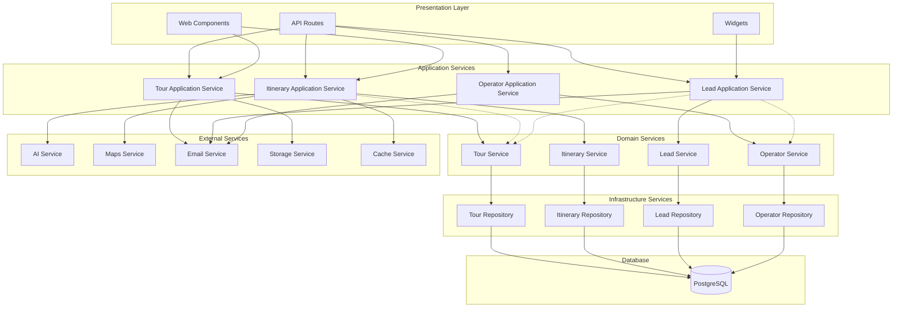
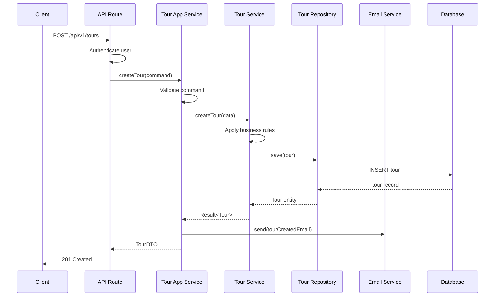
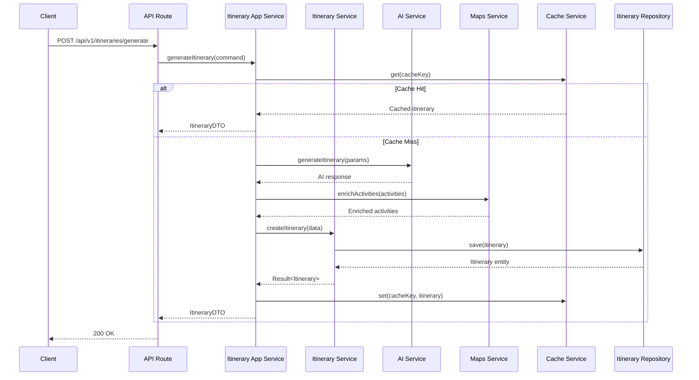
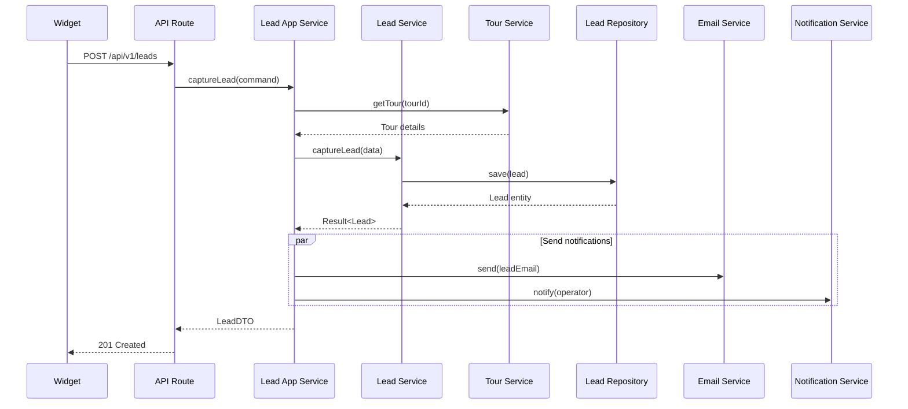

# TripNav Service Dependency Graph

## Visual Service Architecture



## Service Interaction Flows

### 1. Tour Creation Flow



### 2. Itinerary Generation Flow



### 3. Lead Capture Flow



## Service Dependencies Matrix

| Service | Depends On | Used By | External Dependencies |
|---------|-----------|---------|----------------------|
| **Tour Service** | TourRepository | TourAppService, ItineraryAppService, LeadAppService | None |
| **Itinerary Service** | ItineraryRepository | ItineraryAppService | None |
| **Lead Service** | LeadRepository | LeadAppService | None |
| **Operator Service** | OperatorRepository | OperatorAppService, LeadAppService | None |
| **Tour App Service** | TourService | API Routes, Web Components | EmailService, StorageService |
| **Itinerary App Service** | ItineraryService, TourService | API Routes, Web Components | AIService, MapsService, CacheService |
| **Lead App Service** | LeadService, TourService, OperatorService | API Routes, Widgets | EmailService, NotificationService |
| **AI Service** | None | ItineraryAppService | OpenAI API |
| **Maps Service** | None | ItineraryAppService | Google Maps API, Mapbox API |
| **Email Service** | None | All App Services | SendGrid API |
| **Cache Service** | None | ItineraryAppService | Redis |

## Circular Dependency Prevention

### Current Issues
1. **Tour ↔ Itinerary**: Tours reference itineraries, itineraries reference tours
2. **Lead ↔ Operator**: Leads belong to operators, operators have leads
3. **API Routes ↔ Services**: Direct coupling between routes and services

### Resolution Strategy

```typescript
// Use interfaces to break circular dependencies
// core/domain/tour/ITourService.ts
export interface ITourService {
  findById(id: string): Promise<Tour | null>;
}

// core/domain/itinerary/ItineraryService.ts
export class ItineraryService {
  constructor(
    private tourService: ITourService // Interface, not concrete class
  ) {}
}

// Use events for cross-domain communication
// core/domain/events/TourEvents.ts
export class TourPublishedEvent {
  constructor(
    public readonly tourId: string,
    public readonly operatorId: string,
    public readonly publishedAt: Date
  ) {}
}

// core/application/lead/LeadEventHandlers.ts
export class LeadEventHandlers {
  @EventHandler(TourPublishedEvent)
  async handleTourPublished(event: TourPublishedEvent) {
    // React to tour publication without direct dependency
  }
}
```

## Service Boundaries

### Clear Boundaries

```typescript
// ✅ Good: Clear service boundary
// core/domain/tour/TourService.ts
export class TourService {
  async createTour(data: CreateTourDTO): Promise<Tour> {
    // Only handles tour-specific logic
    const tour = Tour.create(data);
    return this.repository.save(tour);
  }
}

// ❌ Bad: Blurred boundary
// api/tours/route.ts (current)
export async function POST(req: Request) {
  // Mixing concerns: auth, validation, business logic, email
  const session = await getSession();
  const data = await req.json();
  
  const tour = await prisma.tour.create({ data });
  await sendEmail(...); // External service in route
  await updateAnalytics(...); // Analytics in route
  
  return Response.json(tour);
}
```

### Service Communication Patterns

```typescript
// 1. Direct dependency (within same bounded context)
class TourApplicationService {
  constructor(private tourService: TourService) {}
}

// 2. Interface dependency (cross-context)
class ItineraryApplicationService {
  constructor(private tourService: ITourService) {}
}

// 3. Event-driven (loose coupling)
class LeadApplicationService {
  async handleTourPublished(event: TourPublishedEvent) {
    // React to tour changes
  }
}

// 4. API Gateway pattern (external clients)
class APIGateway {
  async createTourWithItinerary(data: CreateTourWithItineraryDTO) {
    const tour = await this.tourService.create(data.tour);
    const itinerary = await this.itineraryService.generate({
      tourId: tour.id,
      ...data.itinerary
    });
    return { tour, itinerary };
  }
}
```

## Deployment Boundaries

### Potential Microservice Extraction

```yaml
# Future microservices architecture
services:
  tour-service:
    domain: [Tour, TourTemplate]
    apis: [/api/v1/tours/*, /api/v1/templates/*]
    database: tours_db
    
  itinerary-service:
    domain: [Itinerary, Activity]
    apis: [/api/v1/itineraries/*]
    database: itineraries_db
    dependencies: [tour-service, ai-service]
    
  lead-service:
    domain: [Lead, LeadRouting]
    apis: [/api/v1/leads/*]
    database: leads_db
    dependencies: [tour-service, notification-service]
    
  operator-service:
    domain: [Operator, Integration]
    apis: [/api/v1/operators/*]
    database: operators_db
```

## Performance Considerations

### Service Call Optimization

```typescript
// Batch operations to reduce service calls
class TourApplicationService {
  async getTourssWithStats(operatorId: string) {
    // Bad: N+1 problem
    const tours = await this.tourService.findByOperator(operatorId);
    for (const tour of tours) {
      tour.stats = await this.statsService.getStats(tour.id);
    }
    
    // Good: Batch fetch
    const tours = await this.tourService.findByOperator(operatorId);
    const tourIds = tours.map(t => t.id);
    const stats = await this.statsService.getBatchStats(tourIds);
    
    return tours.map(tour => ({
      ...tour,
      stats: stats.get(tour.id)
    }));
  }
}
```

### Caching Strategy

```typescript
// Service-level caching
class CachedTourService implements ITourService {
  constructor(
    private tourService: TourService,
    private cache: CacheService
  ) {}
  
  async findById(id: string): Promise<Tour | null> {
    const cached = await this.cache.get(`tour:${id}`);
    if (cached) return cached;
    
    const tour = await this.tourService.findById(id);
    if (tour) {
      await this.cache.set(`tour:${id}`, tour, { ttl: 3600 });
    }
    
    return tour;
  }
}
```

This service dependency graph clearly shows the relationships between services and helps identify potential issues like circular dependencies, performance bottlenecks, and deployment boundaries.